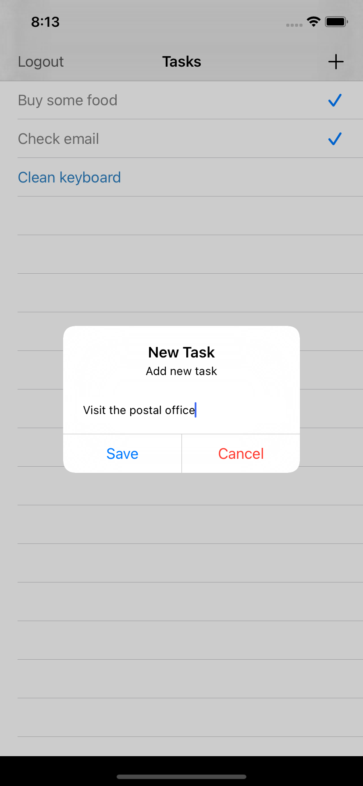

# Swift Basics

Repository for training projects based on SwiftBook and Ray Wenderlich's iOS-course.

Currently contains:
- [Firebase Auth and Realtime DB](#FireTestApp)
- CollectionView & TableView
- Custom table cell from XIB
- Keyboard appearing/disappering actions
- Loading large image in background using GCD (basics)
- CoreData basics
- Kingfisher lib

# FireTestApp

This app is ToDo-list based on Firebase Auth and Realtime DB frameworks

Firebase Auth	| Adding new task	| Editing tasks list
:-------------------------:|:-------------------------:|:-------------------------:
	| 	| 
